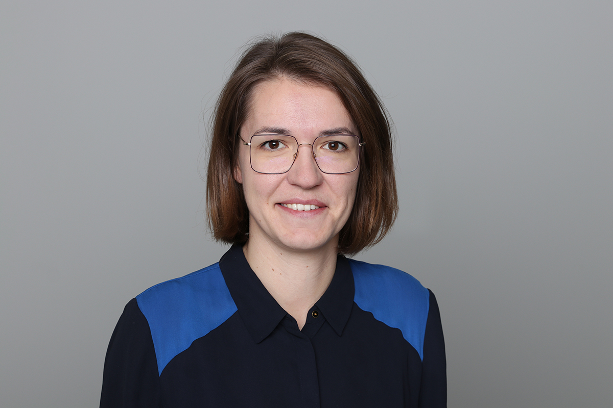

---
layout: default
--- 
  
    
## About

I am a postdoctoral researcher in economics at the University of California, Berkeley, with a focus on labor economics, health economics and public finance. I received my PhD in economics from the University of Basel in 2022. 

My research examines the functioning of insurance markets and transfer systems. In particular, I develop theoretical models and empirical tests to uncover sources of asymmetric information and their implications for social insurance design. 

**[CV](docs/Zabrodina_CV.pdf)**

**[Email](mailto:zabrodina@berkeley.edu)**

 

<!--  -->
<!-- {: style="float: left"} -->
<!-- align="left" -->

***

## Research 
 
### Working papers

- **[Timing Moral Hazard under Deductibles in Health Insurance](docs/Zabrodina_TMH.pdf)** 

  

    
Abstract

    
  This paper evaluates whether individuals strategically time their healthcare consumption to reduce out-of-pocket costs, and the frictions they face in doing so. I set up a dynamic model of healthcare consumption in which individuals suffer a large health shock, exceed their deductible, and have an incentive to advance care from the following year. The model provides a sufficient statistic for timing moral hazard by comparing the consumption of individuals with shocks at random times within the coverage year. It also shows that advancing care mitigates classical moral hazard and adverse selection the following year. This insight highlights important trade-offs for insurance market design. In the context of mandatory health insurance in Switzerland, I find substantial timing moral hazard, though with strong dynamic frictions. The shorter the time horizon, the less care is advanced. The timing of health risk realizations has important implications for cost-sharing and insurance premiums.

  

  This paper earned the Young Economist Award from the [Swiss Society of Economics and Statistics](https://www.sgvs.ch/awards/), as well as the Student Paper Prize 2nd place from the [International Health Economics Association](https://healtheconomics.org/awards/) in 2023.

- **[Unemployment Insurance with Response Heterogeneity](https://docs.iza.org/dp16509.pdf)** (with [Conny Wunsch](https://sites.google.com/view/cwunsch)) [New draft coming soon]
  
  

    
Abstract

    
  The generosity of social insurance coverage often increases with the beneficiary's age and their contribution time to social security, but existing policies vary considerably. We study the differentiation of unemployment insurance (UI) generosity by evaluating how the insurance-incentive trade-off varies with age and contribution time. We exploit numerous discontinuities in potential benefit duration in Germany. Contribution time in the last three years carries information on job search efforts, as it is associated with lower moral hazard responses and fiscal externality. We find no significant response heterogeneity in age or longer contribution time horizons. Contrasting these gradients with an approximated insurance value for four UI regimes, we document that steepening the potential benefit duration schedule in contribution time and flattening it in age would have increased welfare.

  

  

- **[Income Tax Notches and Working Hours Mismatch: Evidence from Mini Jobs in Germany](docs/Unterhofer_Zabrodina_minijobs.pdf)** (with Ulrike Unterhofer) 
  
  

    
Abstract

    
  Many workers do not work their desired number of hours, especially in the low-earning segment. We study whether income tax notches cause hours mismatch among mini jobbers in Germany, which are small jobs exempt from taxes up to a specific earnings threshold. We find substantial underemployment at the threshold, indicating it limits the workers targeted by the policy from reaching their optimum hours. A reform that raised the threshold increased mini jobbers' earnings, but also raised underemployment, as desired hours increased more than actual ones. Our findings suggest that firms' preferences for mini jobs shape the earnings distribution, with implications for estimating labor supply responses. 

  

### Work in progress

- Unemployment Insurance and Exits from Employment (with [Conny Wunsch](https://sites.google.com/view/cwunsch) and Jeffrey Grogger). 

- The Optimal Time-Profile of Unemployment Insurance Benefits (with [Conny Wunsch](https://sites.google.com/view/cwunsch)). 

### Publications

- Zabrodina, Véra, Mark Dusheiko, and Karine Moschetti (2020). [A Moneymaking Scan: Dual Reimbursement Systems and Supplier-Induced Demand for Diagnostic Imaging](https://doi.org/10.1002/hec.4152). _Health Economics_, 29(12):1566--1585. 

  This paper won the iHEA Early Career Researcher Best Paper Prize. <!-- Check out the [follow-up interview](https://www.healtheconomics.org/page/ECRVeraZabrodina) by the iHEA Early Career Researcher Special Interest Group (ECR-SIG). -->

Pre-doctoral publications

- Moschetti, Karine, Véra Zabrodina, Tenzin Wangmo, Alberto Holly, Jean-Blaise Wasserfallen, Bernice S. Elger, and Bruno Gravier (2018). [The determinants of healthcare expenditures of prisoners: Evidence from Switzerland](https://doi.org/10.1186/s12913-018-2962-8). _BMC Health Services Research_, 18:160. 

- Moschetti, Karine, Véra Zabrodina, Pierre Stadelmann, Tenzin Wangmo, Alberto Holly, Jean-Blaise Wasserfallen, Bernice S. Elger, and Bruno Gravier (2017). [Exploring differences in healthcare utilization of prisoners in the canton of Vaud, Switzerland](https://doi.org/10.1371/journal.pone.0187255). _PLOS ONE_, 12(10):e0187255. 

***

## Teaching 

- Causal Inference for Policy Evaluation, MSc and PhD, University of Basel (2021-2024) 

- Applied Empirical Analysis, MSc and PhD, University of Basel (2020)

- Empirical Research Methods in Labour Economics, MSc and PhD, University of Basel  (2018, 2019)

- Advanced Empirical Research Methods, MSc and PhD, University of Basel (2018, 2019)

***

